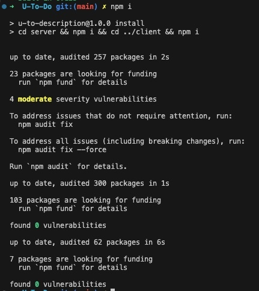
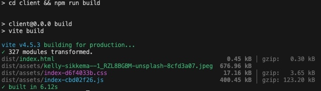
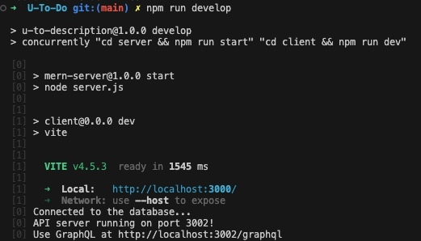

# U-To-Do

A MERN stack web To-Do application template utilizing Vite.

## Table of Contents

- [Description](#description)
- [Usage](#usage)
- [Contributions](#contributions)
- [Technologies](#technologies)
- [Liscence](#liscence)

## Description

Welcome to our collaborative ToDo List App! This app is designed to streamline your task management process by allowing multiple users to create and share ToDo lists with each other. Say goodbye to scattered sticky notes and endless email chains, and hello to efficient and organized teamwork!

## Usage

### Prerequisites

1. **Node.js and npm**: Make sure you have Node.js and npm installed on your system. You can download and install them from [here](https://nodejs.org/).

2. **MongoDB**: Install MongoDB on your local machine if your project uses a MongoDB database. You can download MongoDB Community Server from [here](https://www.mongodb.com/try/download/community).

### Live Production:

A live deployment of the application can be found [here](https://u-to-do.onrender.com/).

### Local Development:

1. If you would like to use the application for local development first clone the repo, then install dependencies with:

```
npm install
```



2. Then build the front end with the following command:

```
npm run build
```



3. Lastly, use the following command to start the development environment:

```
npm run develop
```



## Contributions

[Matthew Cook](https://github.com/mcook2323)

-

[LeVente Berry](https://github.com/hokage-216)

-

[Dom Simonetta](https://github.com/DomSimonetta)

-

[Ayo Okediji](https://github.com/Ayotheman12)

-

## Technologies

- **Frontend**: HTML5, CSS3, JavaScript, JSX, React.js, Vite, Eslint
- **Backend**: Node.js, Express.js, GraphQL, Apollo Server, JWT, Mongoose, BCrypt
- **Version Control**: Git and GitHub

## Liscence

Licensed under the MIT license. To view the license terms [click here](https://opensource.org/licenses/MIT).
